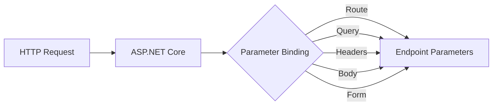

# Parameter Binding in .NET Core

## Table of Contents
- [Overview](#overview)
- [Parameter Sources](#parameter-sources)
- [ApiController Attribute](#apicontroller-attribute)
- [Binding Sources Attributes](#binding-sources-attributes)
- [Examples](#examples)
- [Best Practices](#best-practices)

## Overview

Parameter binding is a crucial feature in ASP.NET Core where the framework automatically maps incoming HTTP request data to method parameters in your controller endpoints. This process eliminates the need for manual parameter extraction and conversion.



## Parameter Sources

ASP.NET Core can bind parameters from various sources in the HTTP request:

| Source | Attribute | Description | Example |
|--------|-----------|-------------|----------|
| Route | `[FromRoute]` | Values from URL route segments | `[Route("api/polls/{id}")]` |
| Query | `[FromQuery]` | Values from query string | `api/polls?pageSize=10` |
| Body | `[FromBody]` | Values from request body (JSON) | POST with JSON payload |
| Form | `[FromForm]` | Values from form data | Form submission |
| Headers | `[FromHeader]` | Values from HTTP headers | Custom headers |

## ApiController Attribute

The `[ApiController]` attribute provides default binding behaviors:

```csharp
[ApiController]
[Route("api/[controller]")]
public class PollsController : ControllerBase
{
    // Complex types are automatically bound from the request body
    [HttpPost]
    public IActionResult Create([FromBody] Poll request)
    {
        // Implementation
    }
}
```

**Key Benefits:**
- Automatic model validation
- Automatic 400 responses for invalid models
- Default binding source inference
- Simplified binding source attribution

## Binding Sources Attributes

Example of using different binding sources in a single endpoint:

```csharp
public class PollsController : ControllerBase
{
    [HttpPut("{id}")]
    public IActionResult Update(
        [FromRoute] int id,
        [FromBody] Poll poll,
        [FromHeader(Name = "X-Custom-Header")] string customHeader,
        [FromQuery] string version
    )
    {
        // Implementation
    }
}
```

## Examples

### 1. Route Parameter Binding

```csharp
[HttpGet("{id}")]
public IActionResult GetPoll(int id)  // id comes from route
{
    return Ok(_pollService.GetById(id));
}
```

### 2. Query String Binding

```csharp
[HttpGet]
public IActionResult GetPolls([FromQuery] int pageSize, [FromQuery] int pageNumber)
{
    return Ok(_pollService.GetPaged(pageSize, pageNumber));
}
```

### 3. Body Binding (JSON)

```csharp
[HttpPost]
public IActionResult CreatePoll([FromBody] Poll poll)
{
    _pollService.Add(poll);
    return CreatedAtAction(nameof(GetPoll), new { id = poll.Id }, poll);
}
```

### 4. Form Data Binding

```csharp
[HttpPost("upload")]
public IActionResult UploadPollImage([FromForm] IFormFile file)
{
    // Handle file upload
    return Ok();
}
```

## Best Practices

1. **Explicit Binding Sources**
   - Always use explicit binding source attributes when multiple parameters are involved
   - Makes the code more readable and maintainable
   - Prevents ambiguity in parameter binding

2. **Model Validation**
   - Use data annotations for model validation
   - Handle validation errors appropriately
   - Return proper status codes for invalid requests

3. **Default Conventions**
   - Simple types (int, string, etc.) from route or query string
   - Complex types from request body
   - Use `[ApiController]` attribute for consistent behavior

4. **Documentation**
   - Use XML comments and Swagger/OpenAPI annotations
   - Clearly document expected parameter sources
   - Include example requests in documentation

```csharp
/// <summary>
/// Updates an existing poll
/// </summary>
/// <param name="id">The poll ID from route</param>
/// <param name="poll">The updated poll data in request body</param>
[HttpPut("{id}")]
public IActionResult Update([FromRoute] int id, [FromBody] Poll poll)
{
    _pollService.Update(id, poll);
    return NoContent();
}
```

This documentation provides a comprehensive overview of parameter binding in ASP.NET Core, including various sources, attributes, and best practices. The included diagrams and examples should help developers understand and implement proper parameter binding in their applications.


# Object Mapping in .NET Core

## Table of Contents
- [Overview](#overview)
- [Understanding DTOs](#understanding-dtos)
- [Project Structure](#project-structure)
- [Manual Mapping](#manual-mapping)
- [Implementation Example](#implementation-example)
- [Best Practices](#best-practices)

## Overview

Object mapping is the process of transforming data between different object shapes, commonly used to convert between Domain Models and DTOs (Data Transfer Objects). While there are several mapping libraries available (like AutoMapper), understanding manual mapping provides insights into the mapping process and can be more performant for simple scenarios.


## Understanding DTOs

DTOs (Data Transfer Objects) are objects specifically designed to transfer data between layers of an application. They help:

1. **Decouple** the client interface from internal domain models
2. **Control** what data is exposed to clients
3. **Version** your API without affecting domain models
4. **Optimize** network traffic by transferring only necessary data

### Example Domain Model vs DTOs

```csharp
// Domain Model
public class Poll
{
    public int Id { get; set; }
    public string Title { get; set; } = string.Empty;
    public string Description { get; set; } = string.Empty;
}

// Request DTO
public class PollRequest
{
    public string Title { get; set; } = string.Empty;
    public string Description { get; set; } = string.Empty;
}

// Response DTO
public class PollResponse
{
    public int Id { get; set; }
    public string Title { get; set; } = string.Empty;
    public string Description { get; set; } = string.Empty;
}
```

## Project Structure

```
YourApi/
├── Contracts/
│   ├── PollRequest.cs
│   └── PollResponse.cs
├── Models/
│   └── Poll.cs
└── Mapping/
    └── ContractMapping.cs
```

Best practice: In a clean architecture, place contracts (DTOs) in a separate class library project for better reusability and separation of concerns.

## Manual Mapping

### Creating the Mapping Class

```csharp
public static class ContractMapping
{
    // Map from Domain Model to Response DTO
    public static PollResponse MapToResponse(this Poll poll)
    {
        return new()
        {
            Id = poll.Id,
            Title = poll.Title,
            Description = poll.Description
        };
    }

    // Map from Request DTO to Domain Model
    public static Poll MapToPoll(this PollRequest request)
    {
        return new()
        {
            Title = request.Title,
            Description = request.Description
        };
    }

    // Map collection of Domain Models to Response DTOs
    public static IEnumerable<PollResponse> MapToResponse(
        this IEnumerable<Poll> polls)
    {
        return polls.Select(MapToResponse);
    }
}
```

## Implementation Example

### Controller Implementation with Mapping

```csharp
[ApiController]
[Route("api/[controller]")]
public class PollsController : ControllerBase
{
    private readonly IPollService _pollService;

    // GET api/polls/{id}
    [HttpGet("{id}")]
    public IActionResult Get([FromRoute] int id)
    {
        var poll = _pollService.Get(id);
        return poll is null 
            ? NotFound() 
            : Ok(poll.MapToResponse());
    }

    // GET api/polls
    [HttpGet]
    public IActionResult GetAll()
    {
        var polls = _pollService.GetAll();
        return Ok(polls.MapToResponse());
    }

    // POST api/polls
    [HttpPost]
    public IActionResult Add([FromBody] PollRequest request)
    {
        var newPoll = _pollService.Add(request.MapToPoll());
        return CreatedAtAction(
            nameof(Get), 
            new { id = newPoll.Id }, 
            newPoll.MapToResponse());
    }

    // PUT api/polls/{id}
    [HttpPut("{id}")]
    public IActionResult Update(
        [FromRoute] int id, 
        [FromBody] PollRequest request)
    {
        var isUpdated = _pollService.Update(id, request.MapToPoll());
        return !isUpdated ? NotFound() : NoContent();
    }
}
```

## Best Practices

1. **Separation of Concerns**
   - Keep mapping logic in dedicated classes
   - Use extension methods for fluent syntax
   - Consider namespace organization for large projects

2. **Performance Considerations**
   - Manual mapping typically offers better performance
   - Consider manual mapping for simple, performance-critical scenarios
   - Use profiling tools to measure impact in your specific case

3. **Mapping Strategy**
   - Use clear naming conventions for mapping methods
   - Consider creating bidirectional mappings when needed
   - Handle null values appropriately
   - Include validation where necessary

4. **Collection Mapping**
   - Use LINQ for collection mappings
   - Consider pagination for large collections
   - Think about memory usage when mapping large sets

5. **Maintenance**
   - Document any non-obvious mapping logic
   - Keep mapping logic close to the DTOs it transforms
   - Consider generating mapping code for complex scenarios

### Pros and Cons of Manual Mapping

| Pros | Cons |
|------|------|
| Better performance | More code to write |
| Full control over mapping logic | More maintenance required |
| Easier debugging | Can become complex with nested objects |
| No external dependencies | Repetitive for large objects |
| Clear data flow | Need to update mapping when models change |

This implementation demonstrates basic manual mapping between DTOs and domain models. While it requires more code than using a mapping library, it provides complete control over the mapping process and typically offers better performance. For more complex scenarios or larger applications, consider using mapping libraries like AutoMapper to reduce boilerplate code and maintenance overhead.


# Implicit and Explicit Conversion Mapping in .NET Core

## Table of Contents
- [Project Structure](#project-structure)
- [Implicit Conversion Mapping](#implicit-conversion-mapping)
- [Explicit Conversion Mapping](#explicit-conversion-mapping)
- [Comparison](#comparison)
- [Implementation Examples](#implementation-examples)
- [Best Practices](#best-practices)

## Project Structure

```
YourApi/
├── Contracts/
│   ├── Requests/
│   │   └── CreatePollRequest.cs
│   └── Responses/
│       └── PollResponse.cs
└── Models/
    └── Poll.cs
```

### Why This Structure?
- Separates concerns by request/response types
- Makes the API contract more organized
- Easier to maintain and version
- Better visibility of API surface area

## Implicit Conversion Mapping

Implicit conversion allows automatic type conversion without explicit casting. It's done using the `implicit operator` keyword.

### Domain Model (Poll.cs)
```csharp
public class Poll
{
    public int Id { get; set; }
    public string Title { get; set; } = string.Empty;
    public string Description { get; set; } = string.Empty;

    // Implicit conversion to PollResponse
    public static implicit operator PollResponse(Poll poll)
    {
        return new()
        {
            Id = poll.Id,
            Title = poll.Title,
            Description = poll.Description
        };
    }
}
```

### Request DTO (CreatePollRequest.cs)
```csharp
public class CreatePollRequest
{
    public string Title { get; set; } = string.Empty;
    public string Description { get; set; } = string.Empty;

    // Implicit conversion to Poll
    public static implicit operator Poll(CreatePollRequest request)
    {
        return new()
        {
            Title = request.Title,
            Description = request.Description
        };
    }
}
```

### Controller Usage with Implicit Conversion
```csharp
public class PollsController : ControllerBase
{
    [HttpGet("{id}")]
    public IActionResult Get([FromRoute] int id)
    {
        var poll = _pollService.Get(id);
        if (poll is null)
            return NotFound();
            
        PollResponse response = poll; // Implicit conversion
        return Ok(response);
    }

    [HttpPost]
    public IActionResult Add([FromBody] CreatePollRequest request)
    {
        var newPoll = _pollService.Add(request); // Implicit conversion
        return CreatedAtAction(
            nameof(Get), 
            new { id = newPoll.Id }, 
            newPoll);
    }
}
```

## Explicit Conversion Mapping

Explicit conversion requires casting and makes the conversion more visible in the code. It uses the `explicit operator` keyword.

### Domain Model (Poll.cs)
```csharp
public class Poll
{
    public int Id { get; set; }
    public string Title { get; set; } = string.Empty;
    public string Description { get; set; } = string.Empty;

    // Explicit conversion to PollResponse
    public static explicit operator PollResponse(Poll poll)
    {
        return new()
        {
            Id = poll.Id,
            Title = poll.Title,
            Description = poll.Description
        };
    }
}
```

### Request DTO (CreatePollRequest.cs)
```csharp
public class CreatePollRequest
{
    public string Title { get; set; } = string.Empty;
    public string Description { get; set; } = string.Empty;

    // Explicit conversion to Poll
    public static explicit operator Poll(CreatePollRequest request)
    {
        return new()
        {
            Title = request.Title,
            Description = request.Description
        };
    }
}
```

### Controller Usage with Explicit Conversion
```csharp
public class PollsController : ControllerBase
{
    [HttpGet("{id}")]
    public IActionResult Get([FromRoute] int id)
    {
        var poll = _pollService.Get(id);
        if (poll is null)
            return NotFound();
            
        var response = (PollResponse)poll; // Explicit conversion
        return Ok(response);
    }

    [HttpPost]
    public IActionResult Add([FromBody] CreatePollRequest request)
    {
        var newPoll = _pollService.Add((Poll)request); // Explicit conversion
        return CreatedAtAction(
            nameof(Get), 
            new { id = newPoll.Id }, 
            newPoll);
    }

    [HttpPut("{id}")]
    public IActionResult Update(
        [FromRoute] int id, 
        [FromBody] CreatePollRequest request)
    {
        var isUpdated = _pollService.Update(id, (Poll)request);
        return !isUpdated ? NotFound() : NoContent();
    }
}
```

## Comparison

| Feature | Implicit Conversion | Explicit Conversion |
|---------|-------------------|-------------------|
| Syntax | No casting required | Requires explicit casting |
| Readability | Less obvious | More obvious |
| Code Clarity | Can be ambiguous | Clear intent |
| Debugging | Harder to track | Easier to track |
| Performance | Same | Same |

## Best Practices

1. **Choose Explicit Over Implicit**
   - Makes code more readable
   - Clear indication of type conversion
   - Easier to debug and maintain
   - Reduces potential confusion

2. **Conversion Location**
   - Place conversion operators in source types
   - Keep conversions simple and straightforward
   - Avoid complex logic in conversion operators

3. **Error Handling**
   - Add null checks in conversion operators
   - Consider throwing exceptions for invalid conversions
   - Document any assumptions or requirements

4. **Documentation**
   - Comment conversion operators
   - Explain any non-obvious mapping logic
   - Document performance implications

5. **Consider Alternatives**
   - Use mapping libraries for complex scenarios
   - Consider manual mapping methods for clarity
   - Think about maintenance requirements

```csharp
// Example with error handling and documentation
public static explicit operator Poll(CreatePollRequest request)
{
    if (request is null)
        throw new ArgumentNullException(nameof(request));

    if (string.IsNullOrWhiteSpace(request.Title))
        throw new ArgumentException("Title is required", nameof(request));

    return new()
    {
        Title = request.Title.Trim(),
        Description = request.Description?.Trim() ?? string.Empty
    };
}
```

While both implicit and explicit conversion operators provide ways to perform mapping, explicit conversion is generally preferred for its clarity and maintainability. However, for complex mapping scenarios or large applications, consider using dedicated mapping libraries like AutoMapper or Mapster for more robust solutions.

# Using Mapster for Object Mapping in .NET Core 8

## Table of Contents
- [Setup and Installation](#setup-and-installation)
- [DTO Implementations](#dto-implementations)
- [Controller Implementation](#controller-implementation)
- [Mapping Configuration](#mapping-configuration)
- [Dependency Injection](#dependency-injection)

## Setup and Installation

Install the required NuGet packages:
```xml
<ItemGroup>
    <PackageReference Include="Mapster" Version="7.4.0" />
    <PackageReference Include="Mapster.DependencyInjection" Version="1.0.1" />
</ItemGroup>
```

## DTO Implementations

### Using Records (Recommended for .NET 8+)
```csharp
// Contracts/Requests/CreatePollRequest.cs
public record CreatePollRequest(
    string Title, 
    string Description);

// Contracts/Responses/PollResponse.cs
public record PollResponse(
    int Id,
    string Title, 
    string Notes);  // Different property name from domain model
```

### Using Classes (Traditional Approach)
```csharp
// Contracts/Requests/CreatePollRequest.cs
public class CreatePollRequest
{
    public string Title { get; init; } = string.Empty;
    public string Description { get; init; } = string.Empty;
}

// Contracts/Responses/PollResponse.cs
public class PollResponse
{
    public int Id { get; init; }
    public string Title { get; init; } = string.Empty;
    public string Notes { get; init; } = string.Empty;  // Different property name from domain model
}

// Domain Model
public class Poll
{
    public int Id { get; set; }
    public string Title { get; set; } = string.Empty;
    public string Description { get; set; } = string.Empty;
}
```

## Controller Implementation

### Using Direct Adapt
```csharp
[ApiController]
[Route("api/[controller]")]
public class PollsController : ControllerBase
{
    private readonly IPollService _pollService;

    public PollsController(IPollService pollService)
    {
        _pollService = pollService;
    }

    [HttpGet("{id}")]
    public IActionResult Get([FromRoute] int id)
    {
        var poll = _pollService.Get(id);
        if (poll is null)
            return NotFound();

        // Inline configuration for property mapping
        var config = new TypeAdapterConfig();
        config.NewConfig<Poll, PollResponse>()
            .Map(dest => dest.Notes, src => src.Description);

        var response = poll.Adapt<PollResponse>(config);
        return Ok(response);
    }
}
```

### Using IMapper Interface
```csharp
[ApiController]
[Route("api/[controller]")]
public class PollsController : ControllerBase
{
    private readonly IPollService _pollService;
    private readonly IMapper _mapper;

    public PollsController(IPollService pollService, IMapper mapper)
    {
        _pollService = pollService;
        _mapper = mapper;
    }

    [HttpGet("{id}")]
    public IActionResult Get([FromRoute] int id)
    {
        var poll = _pollService.Get(id);
        if (poll is null)
            return NotFound();

        var response = _mapper.Map<PollResponse>(poll);
        return Ok(response);
    }
}
```

## Mapping Configuration

### Global Configuration Setup
Create a new class for mapping configuration:

```csharp
public class MappingConfig
{
    public static void Configure()
    {
        TypeAdapterConfig.GlobalSettings.NewConfig<Poll, PollResponse>()
            .Map(dest => dest.Notes, src => src.Description);

        TypeAdapterConfig.GlobalSettings.NewConfig<CreatePollRequest, Poll>()
            .Map(dest => dest.Description, src => src.Description)
            .Map(dest => dest.Title, src => src.Title);
    }
}
```

## Dependency Injection

In Program.cs:
```csharp
var builder = WebApplication.CreateBuilder(args);

// Add Mapster scanning
builder.Services.AddMapster();

// Configure global mappings
MappingConfig.Configure();

var app = builder.Build();
```

## Best Practices

1. **Use Records for DTOs**
   - Immutable by default
   - More concise syntax
   - Better for data transfer scenarios
   - Primary constructors in .NET 8

2. **Global Configuration**
   - Keep mapping configurations in one place
   - Easier to maintain and modify
   - Better visibility of mapping rules

3. **Property Naming**
   ```csharp
   TypeAdapterConfig.GlobalSettings.NewConfig<Poll, PollResponse>()
       .Map(dest => dest.Notes, src => src.Description)
       .IgnoreNonMapped(true);  // Ignore properties that aren't explicitly mapped
   ```

4. **Validation**
   ```csharp
   TypeAdapterConfig.GlobalSettings.NewConfig<CreatePollRequest, Poll>()
       .Map(dest => dest.Description, src => src.Description)
       .MapToConstructor(true)  // Use constructor mapping for records
       .ValidateMap((src, dest) => 
       {
           if (string.IsNullOrEmpty(src.Title))
               throw new ArgumentException("Title is required");
           return true;
       });
   ```

5. **Performance Considerations**
   - Mapster is generally faster than AutoMapper
   - Use compiled mappings for better performance
   - Consider bulk mapping for collections

Using Mapster with records in .NET 8 provides a clean, efficient way to handle object mapping while maintaining immutability and type safety. The choice between records and classes often depends on your specific needs, but records are generally recommended for DTOs due to their immutable nature and concise syntax.
