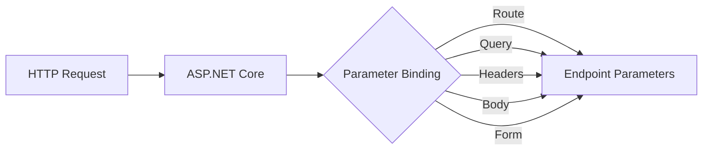

# Parameter Binding in .NET Core

## Table of Contents
- [Overview](#overview)
- [Parameter Sources](#parameter-sources)
- [ApiController Attribute](#apicontroller-attribute)
- [Binding Sources Attributes](#binding-sources-attributes)
- [Examples](#examples)
- [Best Practices](#best-practices)

## Overview

Parameter binding is a crucial feature in ASP.NET Core where the framework automatically maps incoming HTTP request data to method parameters in your controller endpoints. This process eliminates the need for manual parameter extraction and conversion.



## Parameter Sources

ASP.NET Core can bind parameters from various sources in the HTTP request:

| Source | Attribute | Description | Example |
|--------|-----------|-------------|----------|
| Route | `[FromRoute]` | Values from URL route segments | `[Route("api/polls/{id}")]` |
| Query | `[FromQuery]` | Values from query string | `api/polls?pageSize=10` |
| Body | `[FromBody]` | Values from request body (JSON) | POST with JSON payload |
| Form | `[FromForm]` | Values from form data | Form submission |
| Headers | `[FromHeader]` | Values from HTTP headers | Custom headers |

## ApiController Attribute

The `[ApiController]` attribute provides default binding behaviors:

```csharp
[ApiController]
[Route("api/[controller]")]
public class PollsController : ControllerBase
{
    // Complex types are automatically bound from the request body
    [HttpPost]
    public IActionResult Create([FromBody] Poll request)
    {
        // Implementation
    }
}
```

**Key Benefits:**
- Automatic model validation
- Automatic 400 responses for invalid models
- Default binding source inference
- Simplified binding source attribution

## Binding Sources Attributes

Example of using different binding sources in a single endpoint:

```csharp
public class PollsController : ControllerBase
{
    [HttpPut("{id}")]
    public IActionResult Update(
        [FromRoute] int id,
        [FromBody] Poll poll,
        [FromHeader(Name = "X-Custom-Header")] string customHeader,
        [FromQuery] string version
    )
    {
        // Implementation
    }
}
```

## Examples

### 1. Route Parameter Binding

```csharp
[HttpGet("{id}")]
public IActionResult GetPoll(int id)  // id comes from route
{
    return Ok(_pollService.GetById(id));
}
```

### 2. Query String Binding

```csharp
[HttpGet]
public IActionResult GetPolls([FromQuery] int pageSize, [FromQuery] int pageNumber)
{
    return Ok(_pollService.GetPaged(pageSize, pageNumber));
}
```

### 3. Body Binding (JSON)

```csharp
[HttpPost]
public IActionResult CreatePoll([FromBody] Poll poll)
{
    _pollService.Add(poll);
    return CreatedAtAction(nameof(GetPoll), new { id = poll.Id }, poll);
}
```

### 4. Form Data Binding

```csharp
[HttpPost("upload")]
public IActionResult UploadPollImage([FromForm] IFormFile file)
{
    // Handle file upload
    return Ok();
}
```

## Best Practices

1. **Explicit Binding Sources**
   - Always use explicit binding source attributes when multiple parameters are involved
   - Makes the code more readable and maintainable
   - Prevents ambiguity in parameter binding

2. **Model Validation**
   - Use data annotations for model validation
   - Handle validation errors appropriately
   - Return proper status codes for invalid requests

3. **Default Conventions**
   - Simple types (int, string, etc.) from route or query string
   - Complex types from request body
   - Use `[ApiController]` attribute for consistent behavior

4. **Documentation**
   - Use XML comments and Swagger/OpenAPI annotations
   - Clearly document expected parameter sources
   - Include example requests in documentation

```csharp
/// <summary>
/// Updates an existing poll
/// </summary>
/// <param name="id">The poll ID from route</param>
/// <param name="poll">The updated poll data in request body</param>
[HttpPut("{id}")]
public IActionResult Update([FromRoute] int id, [FromBody] Poll poll)
{
    _pollService.Update(id, poll);
    return NoContent();
}
```

This documentation provides a comprehensive overview of parameter binding in ASP.NET Core, including various sources, attributes, and best practices. The included diagrams and examples should help developers understand and implement proper parameter binding in their applications.
